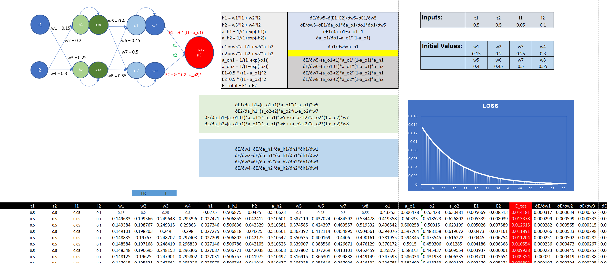

# Assignment 6

## Part 1:
This part involves using MS Excel to calculate backpropogation on a Neural network


## Part 2:
### Target
1. Accuracy > 99.5%
2. Number of Parameters < 25k
3. Num Epochs < 20

### Structure

```
----------------------------------------------------------------
        Layer (type)               Output Shape         Param #
================================================================
            Conv2d-1           [-1, 16, 28, 28]             160
              ReLU-2           [-1, 16, 28, 28]               0
       BatchNorm2d-3           [-1, 16, 28, 28]              32
            Conv2d-4           [-1, 16, 28, 28]           2,320
              ReLU-5           [-1, 16, 28, 28]               0
       BatchNorm2d-6           [-1, 16, 28, 28]              32
         MaxPool2d-7           [-1, 16, 14, 14]               0
           Dropout-8           [-1, 16, 14, 14]               0
            Conv2d-9           [-1, 16, 14, 14]           2,320
             ReLU-10           [-1, 16, 14, 14]               0
      BatchNorm2d-11           [-1, 16, 14, 14]              32
           Conv2d-12           [-1, 16, 14, 14]           2,320
             ReLU-13           [-1, 16, 14, 14]               0
      BatchNorm2d-14           [-1, 16, 14, 14]              32
        MaxPool2d-15             [-1, 16, 7, 7]               0
          Dropout-16             [-1, 16, 7, 7]               0
           Conv2d-17             [-1, 32, 7, 7]           4,640
             ReLU-18             [-1, 32, 7, 7]               0
      BatchNorm2d-19             [-1, 32, 7, 7]              64
           Conv2d-20             [-1, 32, 7, 7]           9,248
             ReLU-21             [-1, 32, 7, 7]               0
      BatchNorm2d-22             [-1, 32, 7, 7]              64
        MaxPool2d-23             [-1, 32, 3, 3]               0
          Dropout-24             [-1, 32, 3, 3]               0
           Conv2d-25             [-1, 10, 3, 3]             330
           Linear-26                   [-1, 10]             910
================================================================
Total params: 22,504
Trainable params: 22,504
Non-trainable params: 0
----------------------------------------------------------------
Input size (MB): 0.00
Forward/backward pass size (MB): 0.85
Params size (MB): 0.09
Estimated Total Size (MB): 0.94
----------------------------------------------------------------
```
