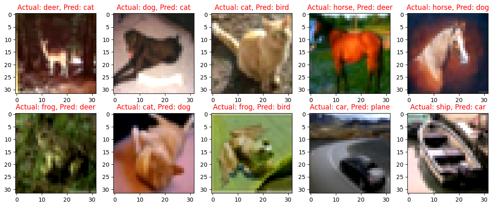
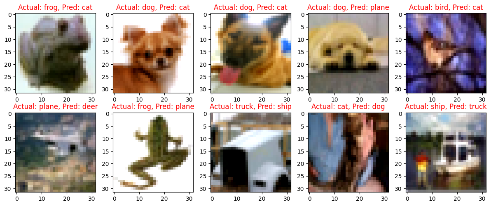
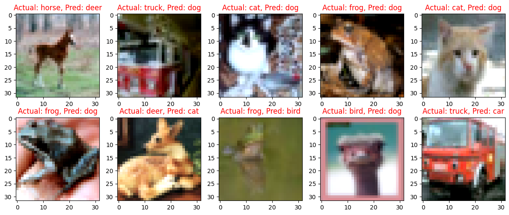

# 📖ERA-V2 Session 8 Assignment
The goal of this assignment is to implement and evaluate the performance of a Convolutional Neural Network (CNN) with different normalization techniques on the CIFAR10 dataset.
- Batch Normalization
- Group Normalization
- Linear Normalization

## 📓 Notebook and Results

Below is a table summarizing the performance of each model. It provides links to the notebooks for each model, along with their respective training and test accuracies.

| Model | Training Accuracy | Test Accuracy |
|-------|-------------------|---------------|
| Batch Normalization | 70.94 % | 75.04 % |
| Group Normalization | 67.98 % | 71.08 % |
| Layer Normalization | 67.90 % | 70.14 % |

## 📈 Findings
Batch Normalization achieved the highest training and test accuracies. Layer Normalization also performed well, with slightly lower accuracies. Group Normalization was with lowest accuracies among these three techniques.

## 📸 Misclassified Images
### Batch Normalization
Few Samples of misclassified images,  

### Group Normalization

Few Samples of misclassified images,  

### Layer Normalization

Few Samples of misclassified images,  

